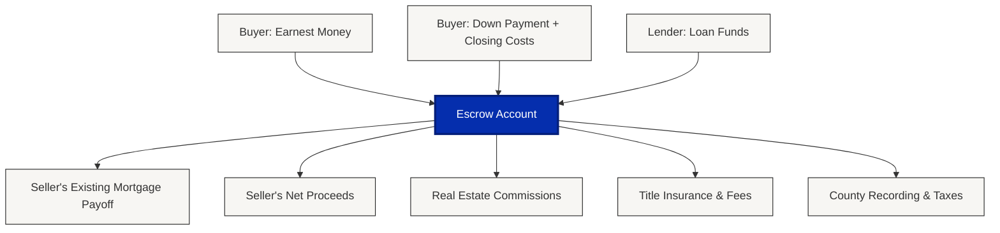

# Title & Escrow

When property changes hands, title and escrow companies ensure the transfer happens legally and securely. They verify ownership is legitimate, protect funds during the transaction, and coordinate the final transfer.

In some states, real estate attorneys handle this work. In others, title companies perform both functions. The terminology varies by location, but the core responsibilities remain the same.

## What Is Title?

**Title represents legal ownership of property.** Buying real estate means acquiring the legal right to own, use, and transfer that property.

Title companies research public records to verify ownership is "clear," meaning:

- No competing ownership claims exist
- No unpaid liens are attached to the property (contractor work, taxes, HOA fees)
- Previous ownership transfers were executed correctly
- No boundary disputes or easement conflicts remain unresolved

**Example:** A seller's ex-spouse forged a signature on a deed during their divorce. Years later, the ex-spouse files suit claiming partial ownership. Without title insurance, the buyer faces legal costs and potential loss of property rights.

Title companies research ownership history (often decades back) and issue title insurance to protect against these risks.

## What Is Escrow?

**Escrow is a neutral holding account.** When large sums transfer during real estate transactions, funds flow through a third-party account rather than directly between parties. This reduces fraud risk and ensures all contract conditions are met before money changes hands.

Common uses of escrow:

- Holding earnest money deposits until closing
- Collecting loan funds from lenders
- Paying off existing mortgages
- Distributing proceeds to sellers
- Covering transaction costs (commissions, taxes, fees)

If a transaction fails to close, escrow protects both parties by holding funds until disputes are resolved according to contract terms.

## How Escrow Works: Fund Flow

All transaction funds flow through the escrow account. The title company holds money securely until all contract conditions are met, then distributes according to the settlement statement.

## Core Functions

<AccordionGroup>
  <Accordion title="Title Research and Insurance">
    **What they do:**

    - Search public records for ownership history
    - Identify liens, judgments, or claims against the property
    - Verify legal descriptions and boundaries
    - Issue title insurance policies (lender's and owner's)
    - Resolve title defects before closing

    **Why it matters:** Buyers need assurance they're receiving legitimate ownership. Lenders won't fund loans on properties with unclear title.
  </Accordion>
  <Accordion title="Escrow Management">
    **What they do:**

    - Open escrow accounts when contracts are executed
    - Hold earnest money deposits securely
    - Collect and verify all transaction funds
    - Coordinate with lenders, agents, and attorneys
    - Disburse funds at closing according to settlement statements

    **Why it matters:** Proper escrow management prevents fraud, ensures contract compliance, and protects all parties financially.
  </Accordion>
  <Accordion title="Closing Coordination">
    **What they do:**

    - Prepare settlement statements and closing documents
    - Schedule closing appointments
    - Facilitate document signing
    - Record deeds and mortgages with county offices
    - Deliver final paperwork to all parties

    **Why it matters:** Closing involves complex documentation and precise timing. Experienced coordination prevents delays and costly errors.
  </Accordion>
</AccordionGroup>

## Why Company Selection Matters

Title and escrow companies handle significant sums and verify critical legal details. Their protocols, insurance coverage, and expertise directly impact transaction security and success.

**Key considerations:**

<CardGroup cols={3}>
  <Card title="Security" icon="shield-check">
    Wire fraud and email scams target real estate transactions. Companies with encrypted portals, verification procedures, and wire fraud insurance provide essential protection.
  </Card>
  <Card title="Accuracy" icon="magnifying-glass">
    Thorough research uncovers ownership problems before closing. Missed issues become the buyer's legal and financial burden after transfer.
  </Card>
  <Card title="Expertise" icon="file-signature">
    Licensed settlement agents can explain documents and answer questions during closing. Notaries simply witness signatures without providing guidance.
  </Card>
</CardGroup>

<Note>
  **Typical Costs**

  Title insurance and closing fees generally total 1% of the purchase price. On a $300,000 property, expect approximately $3,000 in title-related costs. Rates and fees vary by state and company.
</Note>

## Who Chooses The Title Company

Choice varies by state and local custom:

- In some markets, buyers select and pay for title services
- In others, sellers choose and cover costs
- Some areas split responsibilities between buyer and seller
- Transaction contracts specify which party controls the selection

Regardless of local custom, both buyers and sellers have the legal right to choose their own title representation. Lenders may suggest companies but cannot require specific providers.

## What's Next

<CardGroup cols={3}>
  <Card title="How to Evaluate" icon="list-check" href="/service-categories/title-escrow/how-to-evaluate">
    Questions that reveal security protocols, experience, and reliability
  </Card>
  <Card title="What to Expect" icon="timeline" href="/service-categories/title-escrow/what-to-expect">
    Timeline, process, and requirements from contract through closing
  </Card>
  <Card title="Wire Fraud Protection" icon="shield-exclamation" href="/service-categories/title-escrow/wire-fraud-protection">
    How to protect funds from the fastest-growing scam in real estate
  </Card>
</CardGroup>

---

<Card title="Compare Title & Escrow Companies" icon="magnifying-glass" href="https://hometrics.com/title-escrow">
  Research companies with verified reviews, security protocols, and settlement expertise. Compare options before transactions begin.
</Card>